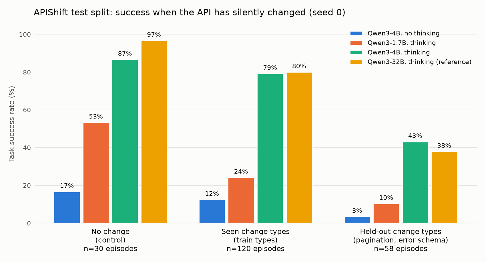

# APIShift

An RL environment for tool-use agents whose APIs have silently changed since
their tool schemas were written. The agent gets the original (stale) schemas.
The live sandbox API has been mutated. To succeed, the agent has to notice
failures, read errors or `get_api_docs(endpoint)`, and adapt.

The spec and milestones are in [AGENTS.md](AGENTS.md).

## Quickstart

```bash
uv sync
make test   # isolation tests (reward, predicates) + E2E sweep
make e2e    # regenerate artifacts/e2e (byte-identical for a given seed)
```

## What exists

| Piece | Where |
|-------|-------|
| 3 mock APIs (calendar, payments, ecommerce), 9-10 endpoints each | `apishift/envs/{calendar,payments,ecommerce}.py` |
| Mutation engine: 4 train + 2 held-out types | `apishift/envs/mutations.py`, `apishift/envs/formats.py` |
| Seeded mutation sampling (rejects inert and unsolvable mutations) | `apishift/sampling.py` |
| 150 tasks (105 train / 15 val / 30 test), success predicates on final state | `apishift/tasks/` |
| Agent loop (max 8 turns, OpenAI tool-call format) | `apishift/agent/loop.py` |
| Reward | `apishift/reward.py` |
| Episode traces | `apishift/episode.py` |
| E2E runner and artifact | `apishift/e2e.py`, `artifacts/e2e/` |

### Mutation types

| Type | Split | Example |
|------|-------|---------|
| `rename_param` | train | `create_event.title` becomes `summary` |
| `format_change` | train | `"2026-10-01 14:00"` becomes ISO 8601; dollars become integer cents; address string becomes an object; legacy IDs become `gid://` IDs; attendees become objects |
| `new_required_field` | train | `create_charge` now requires `currency` |
| `deprecation_with_migration` | train | `cancel_event` returns 410 and points to `set_event_status` |
| `pagination_change` | test only | list endpoint returns `{data, has_more, next_cursor}`, target on page 2 or later |
| `error_schema_change` | test only | errors become RFC 7807 problem+json (422, no hints), on top of a breaking change |

## Testing approach

Following AGENTS.md:

- **Isolation tests only for the reward and the predicates.** Their failure
  modes were written down first in
  [docs/failure_modes.md](docs/failure_modes.md), then the tests, then the code.
- **Everything else is tested end to end.** `tests/e2e/test_episode_e2e.py`
  runs every task under every applicable mutation with scripted agents, and
  checks that:
  - the stale plan succeeds with no mutation, and fails under every mutation
    (no mutation is a no-op);
  - an oracle that adapts correctly succeeds with reward 1.0 at exactly
    `min_turns`;
  - adversarial agents (claim success, malformed args, unknown tool, docs only)
    get 0 reward and change nothing;
  - `get_api_docs` reflects the live schema;
  - held-out types appear only in test;
  - the artifact is byte-identical across runs and matches the committed
    `artifacts/e2e/MANIFEST.sha256`.

## Reward

`1.0` if the success predicate holds on the final state, minus `0.05` per
invalid call (any error response), minus `0.02` per turn beyond the minimum,
floored at `0`. The minimum is the turn count of a docs-first oracle under the
episode's mutation, so the discovery step a mutation forces is never
penalized.

## Baselines (test split, seed 0)



| Model | Control | Seen types | Held-out types | Mean reward |
|-------|---------|------------|----------------|-------------|
| Qwen3-4B, no thinking (greedy) | 17% | 12% | 3% | 0.10 |
| Qwen3-1.7B, thinking (T=0.6) | 53% | 24% | 10% | 0.23 |
| Qwen3-4B, thinking (T=0.6) | 87% | 79% | 43% | 0.66 |
| Qwen3-32B-FP8, thinking (T=0.6) | 97% | 80% | 38% | 0.67 |

Episodes per group: 30 control, 120 seen, 58 held-out. Served with vLLM 0.30
on Modal, with tools sent as `strict: false`. Pagination is the hardest type
for every model: 18-21% even with thinking. Superseded runs and why they are
invalid: `results/v0_no_lookup_hint/`, `results/v1_strict_tools/`. Costs:
`budget_log.csv`.
